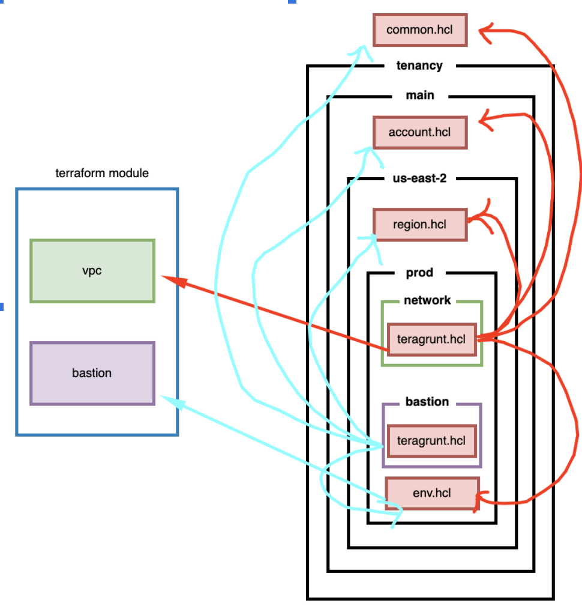

## Terragrunt
This repository implements a skeleton repository for teams to use when first getting started with terraform. It uses terragrunt as a workflow tool.   

## Why Terragrunt
When I was getting started, it wasn’t obvious to me how to organize a terraform project in a way that makes “the easy things easy and the hard things possible” and would scale well as a team grows. Terragrunt helps a great deal, but there are many configuration options, adding to the organizational complexity.
Please read more at [Link](https://transcend.io/blog/why-we-use-terragrunt/).       

## Organizing Terragrunt
```
├── CHANGELOG.md
├── README.md
├── deployment
│   ├── common.terragrunt.hcl
│   └── tenancy
│       ├── main
│       │   ├── account.terragrunt.hcl
│       │   └── us-east-2
│       │       ├── prod
│       │       │   ├── bastion
│       │       │   │   └── terragrunt.hcl
│       │       │   ├── environment.terragrunt.hcl
│       │       │   └── network
│       │       │       ├── README.md
│       │       │       └── terragrunt.hcl
│       │       ├── region.terragrunt.hcl
│       │       └── stage
│       │           └── environment.terragrunt.hcl
│       └── secondary
│           ├── account.terragrunt.hcl
│           └── us-west-1
│               ├── dev
│               │   ├── environment.terragrunt.hcl
│               │   └── stack
│               │       └── terragrunt.hcl
│               └── region.terragrunt.hcl
└── modules
    ├── README.md
    ├── bastion
    │   ├── bastion.tf
    │   ├── outputs.tf
    │   ├── templates
    │   │   └── bastion
    │   │       ├── instance-profile-policy.json
    │   │       └── user-data.sh
    │   ├── terragrunt.hcl
    │   └── variables.tf
    └── vpc
        ├── README.md
        └── vpc.hcl
```
## Directory Structure

### Deployment   
deployments are instantiations of infrastructure. Deployments are organized in a directory tree. The first level in the tree is the "tenacy tiers", Small projects may just have a single tier of tenancy. For larger projects, there are often multiple tiers relying or building on each other. Sometimes these tiers are managed by different teams.   
For instance: tenancy , jenkins,...
```
├── deployment
│   ├── common.terragrunt.hcl
│   ├── tenancy
│   ├── jenkins
│   └── ...
```
Each tier consists of one or more instantiations called "account tier"    
For instance: account for production, staging(tier main), account for dev test(tier secondary)
```
│   └── tenancy
│       ├── main
│       │   ├── account.terragrunt.hcl
│       │           
│       └── secondary
```
Underneath each "account tier", you have "region tier". Small projects may just have a single tier of region. For larger projects, there are often multiple "region tiers" .     
For instance: us-east-1, us-east-2, ...
```
│       ├── main
│       │   ├── account.terragrunt.hcl
│       │   ├── us-east-1
│       │   ├── us-east-2
│       │   └── ...
```
Underneath each "region tier", you have "environment tier"
For instance: prod, stage.
```
│       │       ├── prod
│       │       ├── region.terragrunt.hcl
│       │       └── stage
```
Underneath each "environment tier", you have "modules tier"
For instance: bastion, network.

### Modules
stacks are root terraform modules and group together infrastructure that is managed as a unit. Underneath modules, you have sub module.     
Summarized, each deployment references a stack.   

## How to call them


## Install Terragrunt

### Download from releases page

1. Go to the [Releases Page](https://github.com/gruntwork-io/terragrunt/releases).
2. Downloading the binary for your operating system: e.g., if you're on a Mac, download `terragrunt_darwin_amd64`; if you're on Windows, download `terragrunt_windows_amd64.exe`, etc.
3. Rename the downloaded file to `terragrunt`.
4. Add execute permissions to the binary. E.g., On Linux and Mac: `chmod u+x terragrunt`.
5. Put the binary somewhere on your `PATH`. E.g., On Linux and Mac: `mv terragrunt /usr/local/bin/terragrunt`.

### Install via a package manager

Note that all the different package managers are third party.The third party Terragrunt packages may not be updated with the latest version, but are often close. Please check your version against the latest available on the [Releases Page](https://github.com/gruntwork-io/terragrunt/releases).
If you  want the latest version, the recommended installation option is to [download from the releases page](https://github.com/gruntwork-io/terragrunt/releases).

* **Windows**: You can install Terragrunt on Windows using [Chocolatey](https://chocolatey.org/): `choco install terragrunt`.

* **macOS**: You can install Terragrunt on macOS using [Homebrew](https://brew.sh/): `brew install terragrunt`.

* **Linux**: Most Linux users can use [Homebrew](https://docs.brew.sh/Homebrew-on-Linux): `brew install terragrunt`. Arch Linux users can use `pacman -S terragrunt` to install it [`community-terragrunt`](https://archlinux.org/packages/community/x86_64/terragrunt/).

* **FreeBSD**: You can install Terragrunt on FreeBSD using [Pkg](https://www.freebsd.org/cgi/man.cgi?pkg(7)): `pkg install terragrunt`.

## How to run
### Execute Terraform commands on multiple modules at once
```
cd deployment/tenancy/main/us-east-2/prod
    terragrunt validate-all
    terragrunt graph-dependencies
    terragrunt plan-all
    terragrunt apply-all
    terragrunt output-all
    terragrunt destroy-all
```

### Execute Terraform commands on module bastion
```
cd deployment/tenancy/main/us-east-2/prod/bastion
    terragrunt validate
    terragrunt graph-dependencies
    terragrunt plan
    terragrunt apply
    terragrunt destroy
```

### Execute Terraform commands on module network
```
cd deployment/tenancy/main/us-east-2/prod/network
    terragrunt validate
    terragrunt graph-dependencies
    terragrunt plan
    terragrunt apply
    terragrunt destroy
```